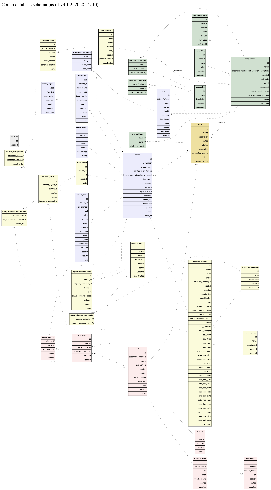
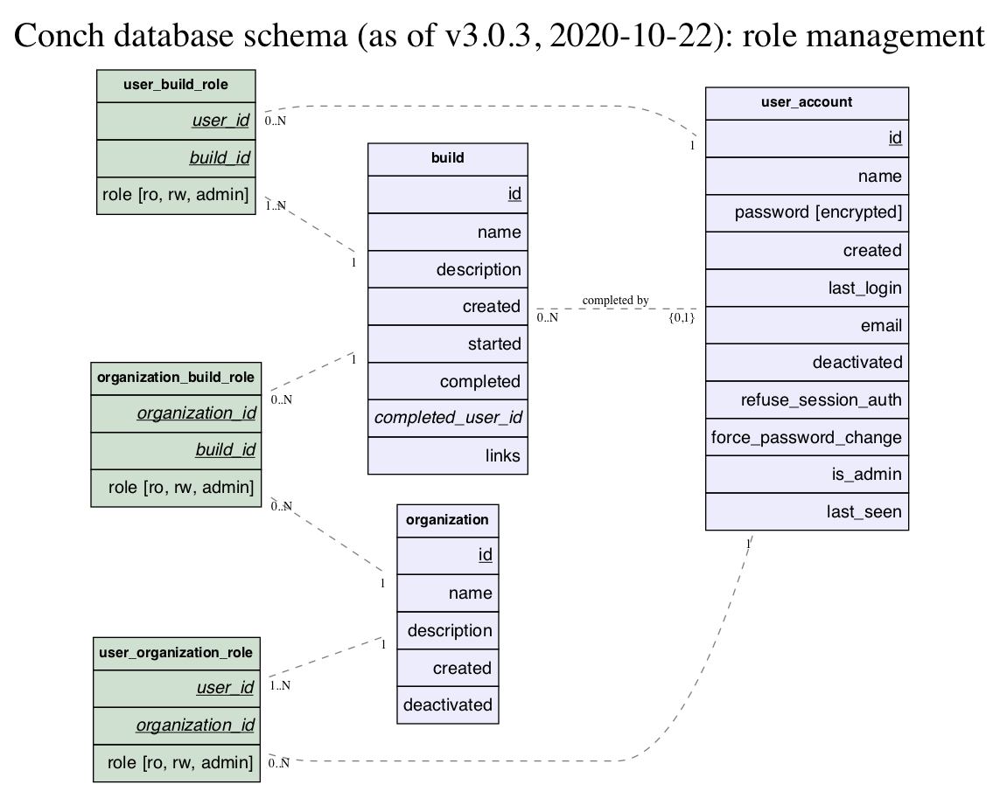
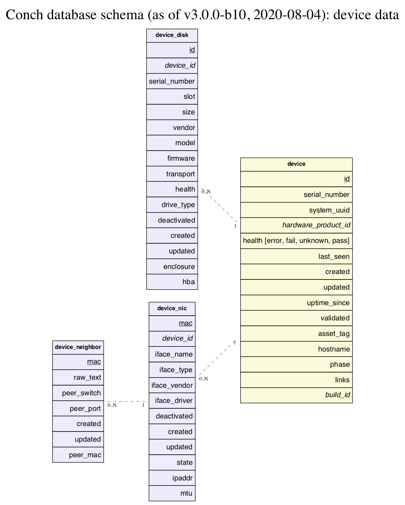
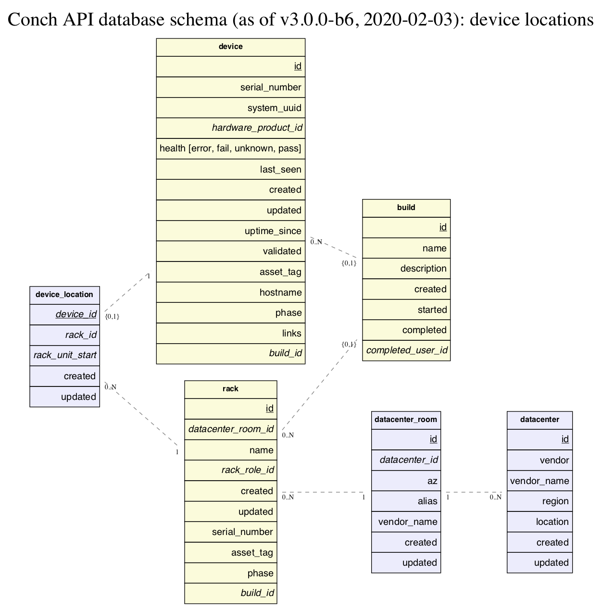
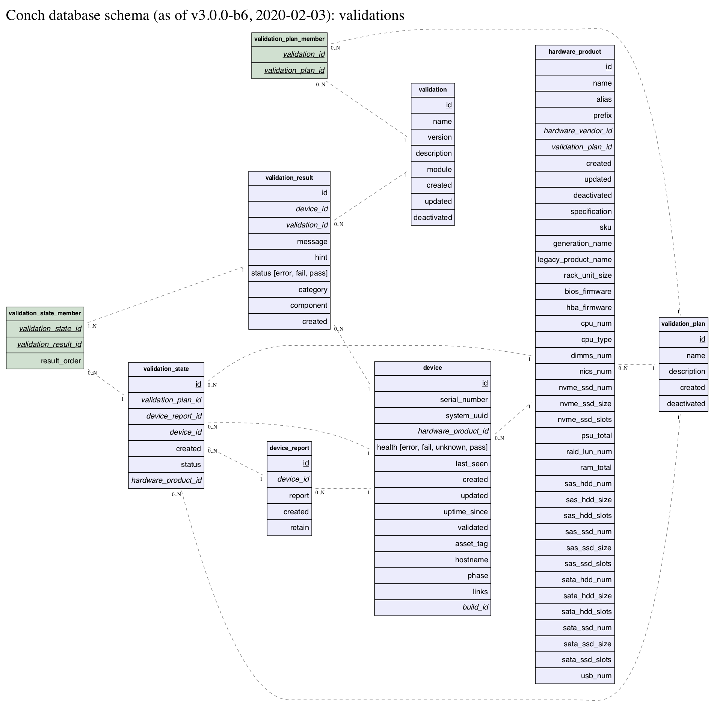

# Introduction

The Conch ecosystem is designed to make the deployment of new server hardware
easier, specifically targetting equipment to be used in the Joyent
SmartDatacenter product line.

Conch has two major backend systems.

First, edge software boots new hardware, upgrades firmware, performs burn-in
testing, and gathers the general state of the hardware. (This software is
currently closed source.)

Second, this edge data is fed into the Conch API (this codebase) where the data
is processed, validated, stored, and reported upon.

# The Ecosystem

* [The Web UI](https://github.com/joyent/conch-ui)
* [The CLI Tooling](https://github.com/joyent/conch-shell)

# Development

Our development process is documented over [here](development).

# Routes / URLs

Unless otherwise specified, all routes require authentication: a user must
[POST /login](modules/Conch::Route#post-login) first, and
then use the provided [JSON Web Token](https://tools.ietf.org/html/rfc7519) for subsequent
requests.

Full access is granted to system admin users; otherwise, access restrictions are as noted.

The majority of our endpoints consume and respond with JSON documents that
conform to a set of JSON schema. These schema can be found in the [json-schema](json-schema)
directory in the main repository, as well as on this documentation site.

Successful (HTTP 2xx code) response structures are as described for each endpoint.

Error responses will use:

- failure to validate query parameters: HTTP 400, [response.json#/definitions/QueryParamsValidationError](json-schema/response.json#/definitions/QueryParamsValidationError)
- failure to validate request body payload: HTTP 400, [response.json#/definitions/RequestValidationError](json-schema/response.json#/definitions/RequestValidationError)
- all other errors, unless specified: HTTP 4xx, [response.json#/definitions/Error](json-schema/response.json#/definitions/Error)

Available routes are:

* [Conch::Route](modules/Conch::Route)
  * [`/ping`](modules/Conch::Route#get-ping)
  * [`/version`](modules/Conch::Route#get-version)
  * [`/login`](modules/Conch::Route#post-login)
  * [`/logout`](modules/Conch::Route#post-logout)
  * [`/refresh_token`](modules/Conch::Route#post-refresh_token)
  * [`/me`](modules/Conch::Route#get-me)

* [Conch::Route::Datacenter](modules/Conch::Route::Datacenter)
  * `/dc`

* [Conch::Route::Device](modules/Conch::Route::Device)
  * `/device`

* [Conch::Route::DeviceReport](modules/Conch::Route::DeviceReport)
  * `/device_report`

* [Conch::Route::HardwareProduct](modules/Conch::Route::HardwareProduct)
  * `/hardware_product`

* [Conch::Route::HardwareVendor](modules/Conch::Route::HardwareVendor)
  * `/hardware_vendor`

* [Conch::Route::RackLayout](modules/Conch::Route::RackLayout)
  * `/layout`

* [Conch::Route::Organization](modules/Conch::Route::Organization)
  * `/organization`

* [Conch::Route::Rack](modules/Conch::Route::Rack)
  * `/rack`

* [Conch::Route::RackRole](modules/Conch::Route::RackRole)
  * `/rack_role`

* [Conch::Route::Relay](modules/Conch::Route::Relay)
  * `/relay`

* [Conch::Route::DatacenterRoom](modules/Conch::Route::DatacenterRoom)
  * `/room`

* [Conch::Route::Schema](modules/Conch::Route::Schema)
  * `/schema`

* [Conch::Route::User](modules/Conch::Route::User)
  * `/user`

* [Conch::Route::Validation](modules/Conch::Route::Validation)
  * `/validation`
  * `/validation_plan`
  * `/validation_state`

* [Conch::Route::Workspace](modules/Conch::Route::Workspace)
  * `/workspace`

# Features

The Conch API has many features to make it a fully-functional and robust REST
application.

* Most endpoints (save trivial ones such as `GET /ping`) require the user to
be authenticated. This lets us mount the application on a world-reachable host
while still protecting our private data.  After `POST /login`, the user is
issued a [Java Web Token](https://en.wikipedia.org/wiki/JSON_Web_Token) for future access.

* Access to various components in the system are protected by a
layered system of roles; for example, a user can be granted access to data
pertaining to just one build, without having access to historical build data
or other devices in the system; or, read-only access to some parts and write
access to other parts.

* All transactions are logged, both in local files and in syslog and MongoDB
for later analysis.  Errors are also sent up to
[Rollbar](https://rollbar.com/joyent_buildops/conch) for immediate developer
attention.

* All endpoints have strict error checking in both request and response
payloads, with errors spelled out clearly in the response to enable easy
development of client code. The payload schemas can be found [here](json-schema).

* Addition, modification and deletion of users, organizations and builds
trigger email notification to the relevant administrators.

* Data is stored in Postgres and backed up nightly to a Manta store.

* All parts of the application are unicode-clean. 우리는 한국어를 합니다!

# Database schemas

The full database schema:
.

Database tables relevant to user roles:
.

Database tables relevant to device data:
.

Database tables relevant to datacenters and device locations:
.

Database tables relevant to device validations:
.

# Modules

Individual module documentation can be found [here](modules).

Script documentation can be found [here](scripts).

JSON Schema defining request and response payloads can be found [here](json-schema).

# Copyright / License

Copyright Joyent, Inc.

This Source Code Form is subject to the terms of the Mozilla Public License,
v.2.0. If a copy of the MPL was not distributed with this file, you can
obtain one at <https://www.mozilla.org/en-US/MPL/2.0/>.
